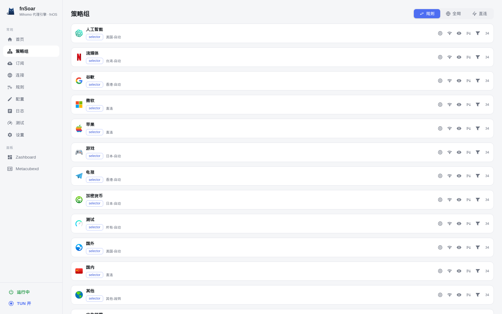
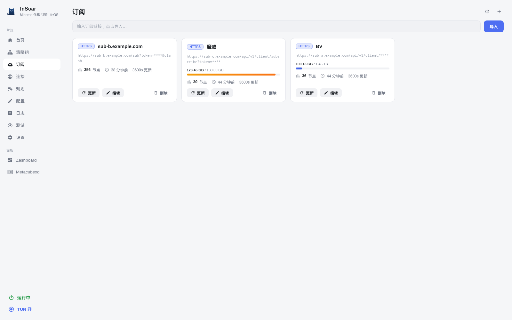
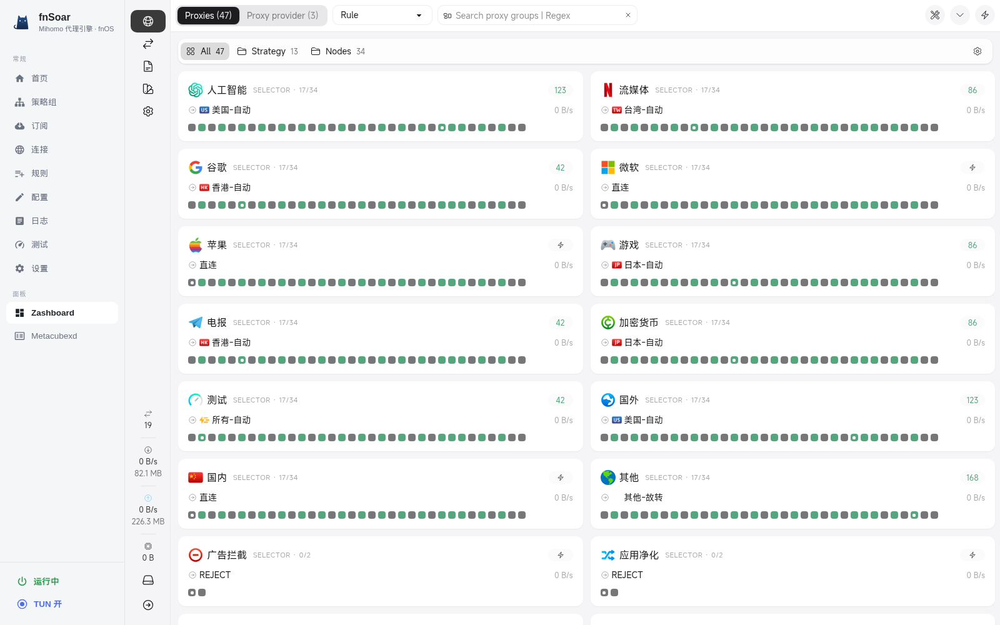
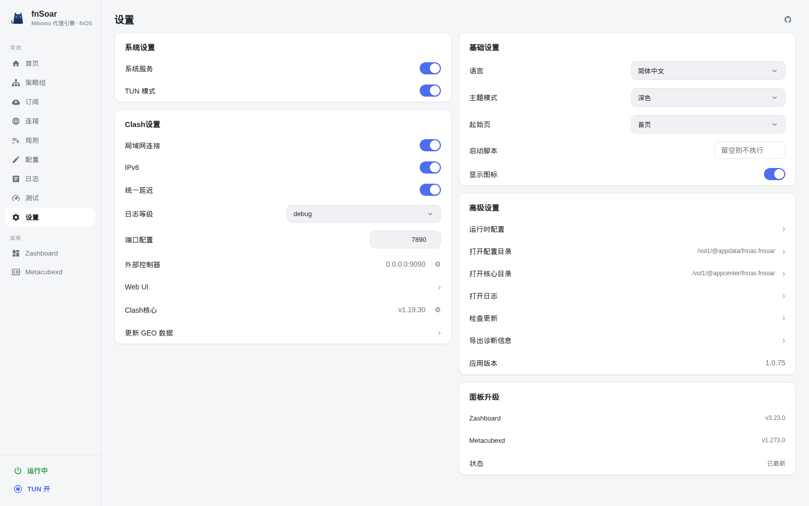

<div align="center">

# fnSoar

**fnOS 上的原生 Mihomo 代理引擎 —— 集成 Zashboard / Metacubexd 双面板、规则引擎、TUN 模式、DNS 分流的一站式代理管理应用**

</div>

fnSoar 是运行于 [fnOS](https://www.fnnas.com) 应用商店的原生代理引擎应用。它内置 **Mihomo（Clash Meta）** 内核，提供中英文双语 Web 控制台，并集成 **Zashboard** 与 **Metacubexd** 两套第三方可视化面板，开箱即用。

## ✨ 功能特性

- 🚀 **Mihomo 内核**：原生集成，支持 Clash 规则 / 全局 / 直连三种模式
- 🖥️ **双面板**：内置 [Zashboard](https://github.com/Zephyruso/zashboard) 与 [Metacubexd](https://github.com/MetaCubeX/metacubexd)，可随时切换
- ⚡ **订阅管理**：支持订阅链接 / 本地上传，切换订阅即时热加载（PUT /configs，约 100ms），无需重启内核
- 📡 **规则引擎**：内置常用分流规则集（Google、Netflix、Telegram、OpenAI 等），支持自定义
- 🧩 **TUN 模式**：一键开启系统级透明代理
- 🔒 **IPv6 防泄露提示**：关闭 TUN 且检测到 IPv6 时，控制台右上角提示；IPv6 UDP/QUIC 在主机透明模式下阻断，需完整 IPv6 UDP 时开启 TUN
- 🛡️ **DNS 分流**：内置 DNS 配置（enhanced-mode、fake-ip、国内/国外 DNS 分离）
- 🌍 **解锁检测**：一键测试流媒体（Netflix / Disney+ / YouTube 等）解锁状态
- 📊 **实时状态**：流量统计、连接列表、规则命中、IP 信息、系统负载
- 🌐 **双语言**：简体中文 / English

## 📸 应用截图

<div align="center">

<table>
  <tr>
    <td align="center">
      <br/>
      <sub><b>首页</b> — 流量概览、节点状态、IP 信息、系统监控</sub>
    </td>
    <td align="center">
      <br/>
      <sub><b>策略组</b> — 分组切换、延迟测速</sub>
    </td>
  </tr>
  <tr>
    <td align="center">
      <br/>
      <sub><b>订阅</b> — 订阅卡片、流量用量、自动更新</sub>
    </td>
    <td align="center">
      <br/>
      <sub><b>Zashboard 面板</b> — 内置第三方可视化面板</sub>
    </td>
  </tr>
  <tr>
    <td align="center" colspan="2">
      <br/>
      <sub><b>设置</b> — TUN 模式、端口配置、DNS、GEO 更新与面板升级</sub>
    </td>
  </tr>
</table>

<sub>深色主题界面 · 截图中的订阅地址与令牌已脱敏</sub>

</div>

## 📦 安装

### fnOS 应用商店（推荐）

1. 下载最新的 `.fpk` 安装包（见 [Releases](https://github.com/Huiikeung/fnsoar/releases)）
2. 打开 fnOS「应用中心」→「手动安装」→ 选择 `fnSoar-*.fpk`
3. 安装完成后从应用中心打开，控制台默认地址 `http://<NAS-IP>:9099/`

### 手动部署

```bash
git clone https://github.com/Huiikeung/fnsoar.git
cd fnsoar
./scripts/build_fpk.sh 1.0.81   # 或任意版本号（缺省取 fnpack/manifest）
```

## 🔧 使用

| 功能 | 位置 |
|------|------|
| 代理模式 / TUN / 局域网 | 控制台「设置」页 |
| 订阅管理 | 控制台「订阅」页 |
| 策略组与节点 | 控制台「策略组」页 |
| Zashboard 面板 | 侧栏「Zashboard」 |
| Metacubexd 面板 | 侧栏「Metacubexd」 |
| 面板一键升级 | 控制台「设置 → 面板升级」 |

## 🛠️ 开发与构建

```bash
# 构建 fpk 安装包（缺省版本号取 fnpack/manifest 中的 version）
./scripts/build_fpk.sh            # 或 ./scripts/build_fpk.sh 1.0.81

# 产物位于 dist/fnSoar1.0.81.fpk（含 -amd64 / -arm64 单独包）
```

### 目录结构

仓库按「后端 / 前端 / fnOS 打包源」分类组织（参考 [Clash-for-fnos](https://github.com/chenpingonline/Clash-for-fnos)）：

```
.
├── backend/                # 后端：Python admin 服务
│   └── admin/              #   admin_server.py / media_unlock.py / server.js 等
├── frontend/               # 前端：管理界面 + 第三方面板静态资源
│   ├── admin/              #   index.html / ui.html / icon
│   └── dashboard/          #   Zashboard / Metacubexd（dist 构建产物，不入库）
├── fnpack/                 # fnOS 打包源（对应安装后的运行目录布局）
│   ├── app/
│   │   ├── bin/            #   启动脚本：mihomo 架构包装器、engine-start
│   │   └── default-config/ #   默认 config.yaml（geo 数据不入库）
│   ├── cmd/                #   fnOS 服务脚本（生命周期）
│   ├── config/             #   fnOS 安装配置（privilege / resource）
│   ├── wizard/             #   fnOS 安装向导
│   ├── ui/                 #   fnOS 桌面入口与图标
│   ├── app.json            #   fnOS 应用清单
│   ├── manifest            #   fnOS 包清单
│   ├── ICON.PNG
│   └── ICON_256.PNG
├── resources/
│   └── core/               # Mihomo 内核，按架构分放（不入库）
│       ├── x86/            #   mihomo-amd64.real
│       └── arm/            #   mihomo-arm64.real
├── scripts/                # 构建与发布脚本
│   ├── build_fpk.sh        #   源码 → .fpk 安装包（产物在 dist/）
│   ├── build.sh            #   源码 → 本机安装目录（开发调试）
│   └── release_v*.sh       #   GitHub Release 发布
├── docs/                   # 文档、截图与发布说明
├── dist/                   # 构建产物（*.fpk 与暂存目录，不入库）
├── LICENSE                 # MIT License
├── THIRD_PARTY_NOTICES.md  # 第三方组件版权声明
└── README.md
```

> 打包时 `scripts/build_fpk.sh` 会把 backend + frontend + fnpack + resources
> 合并成官方规范布局（`app/{admin,bin,dashboard,default-config,ui}`），
> 安装后的运行目录与历史版本一致。

## 🔑 配置说明

- 主配置：`/vol1/@appdata/fnnas.fnsoar/config.yaml`
- 面板文件：`/vol1/@appdata/fnnas.fnsoar/dashboard/`
- 图标库：`/vol1/@appdata/fnnas.fnsoar/icons.yaml`
- 日志：`/vol1/@appdata/fnnas.fnsoar/fnnas.fnsoar.log`

> 控制台「设置 → 打开配置目录」可直接查看。

## ⚖️ 开源协议

本项目采用 **MIT License**，详见 [LICENSE](LICENSE)。

### 第三方组件

本项目分发并集成了以下第三方组件（各自许可证与版权见其官方仓库及运行目录中的说明）：

| 组件 | 用途 | 许可证 |
|------|------|--------|
| [MetaCubeX/mihomo](https://github.com/MetaCubeX/mihomo) | 代理内核 | MIT |
| [Zephyruso/zashboard](https://github.com/Zephyruso/zashboard) | 面板 | MIT |
| [MetaCubeX/metacubexd](https://github.com/MetaCubeX/metacubexd) | 面板 | MIT |
| [Clash Verge Rev](https://github.com/clash-verge-rev/clash-verge-rev) | UI 样式与功能实现参考 | GPL-3.0 |

> ℹ️ Zashboard 内置 `THIRD_PARTY_NOTICES.md`（地球纹理、DB-IP City Lite 等依赖为 CC BY 4.0），分发面板时请随附保留。
>
> ⚠️ **许可兼容性提示**：本仓库部分功能实现参考了 GPL-3.0 的 [Clash Verge Rev](https://github.com/clash-verge-rev/clash-verge-rev)（解锁测试、IP 卡片、merge 增强等）。若这些实现确实构成对 GPL-3.0 代码的复制或衍生，则整个项目可能受 GPL-3.0 copyleft 约束，应以 **GPL-3.0** 进行许可并随附源码，而不能仅以 MIT 发布。若仅属独立重写的思路参考、未复制其代码，则 MIT 仍适用。请在发布前确认参考程度并选择相应协议。

## 🤝 致谢

- [fnOS](https://www.fnnas.com) — 应用运行平台
- [Mihomo (Clash Meta)](https://github.com/MetaCubeX/mihomo) — 内核
- [Zashboard](https://github.com/Zephyruso/zashboard) 与 [Metacubexd](https://github.com/MetaCubeX/metacubexd) — 面板
- [Clash Verge Rev](https://github.com/clash-verge-rev/clash-verge-rev) — 界面样式与部分功能实现参考（解锁测试、IP 信息卡片、merge 偏好合并、首页布局等），GPL-3.0